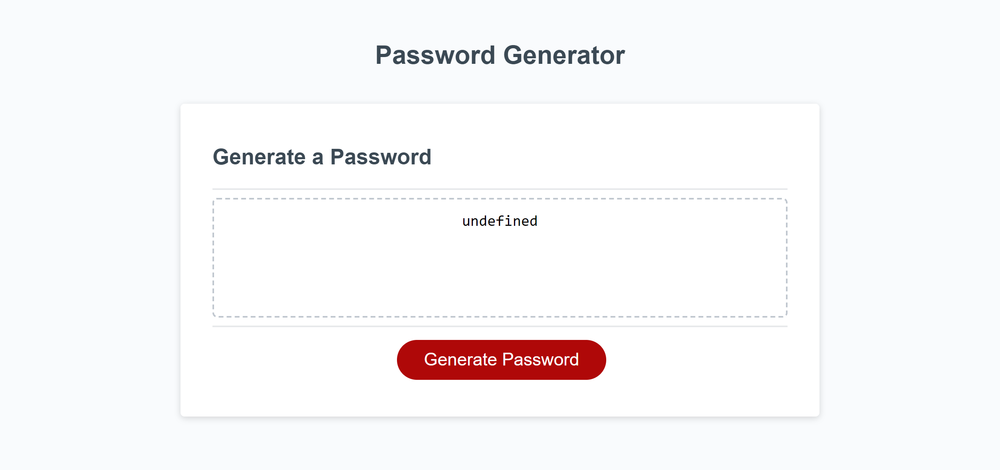

# Module 3 Challenge | JavaScript Challenge: Password Generator
## Password Generator
## Description
This is the completed application of the password generator for the Module 3 JavaScript Challenge. The purpose of this challenge was to make a functioning password generator powered by JavaScript code. The generated password meets the certain selected criteria such as password length, uppercase letters, lowercase letters, special characters, and numbers. 
## Screenshot

## Deployed Link
Link to deployed application:
https://thitareep.github.io/Mod3_PasswordGenerator/